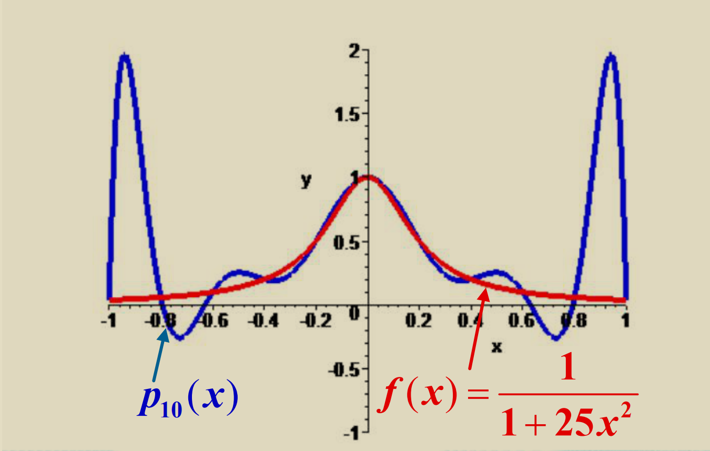
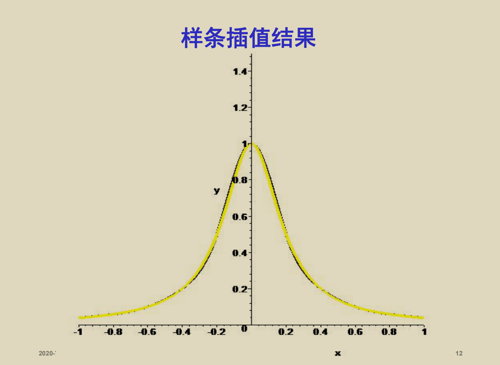
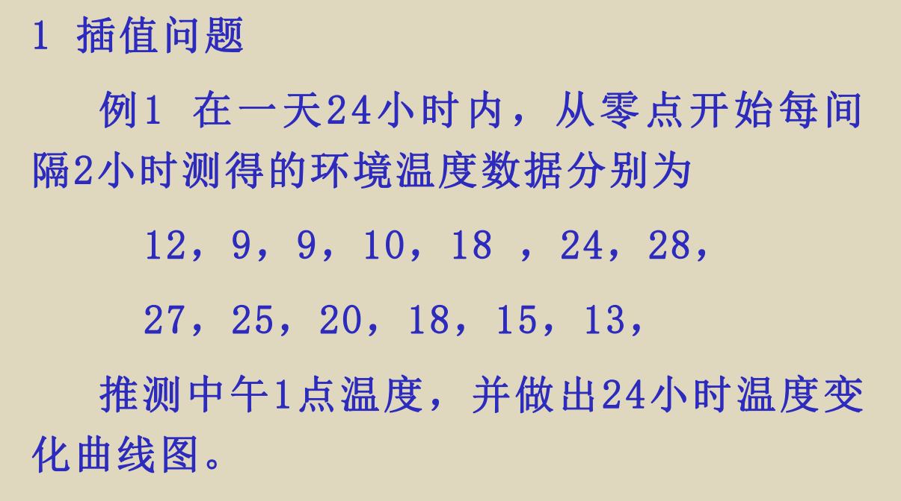
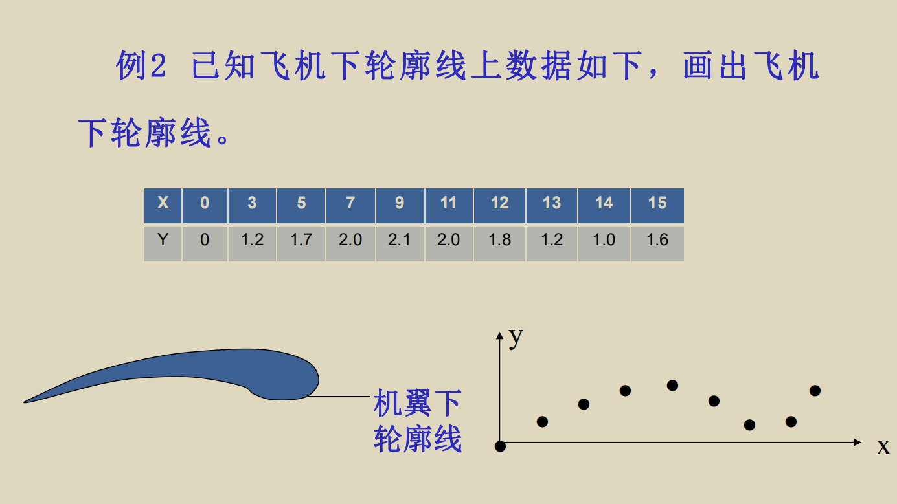
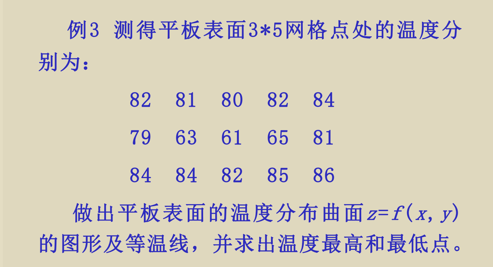
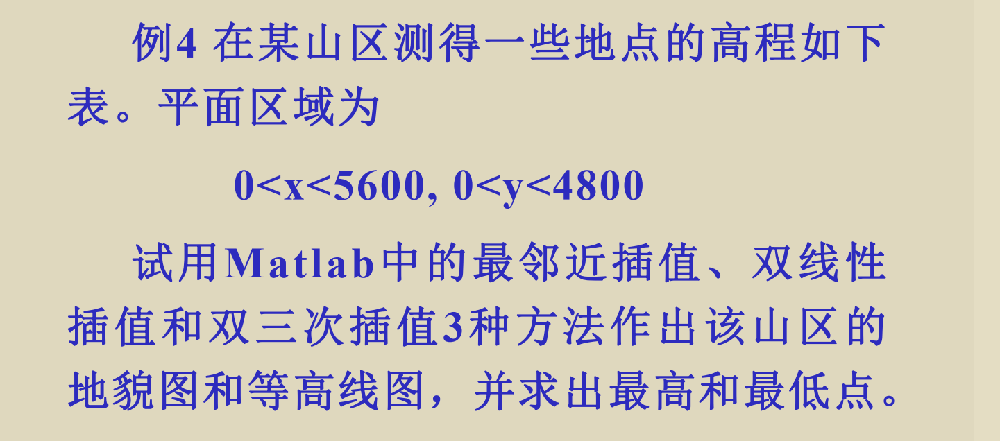
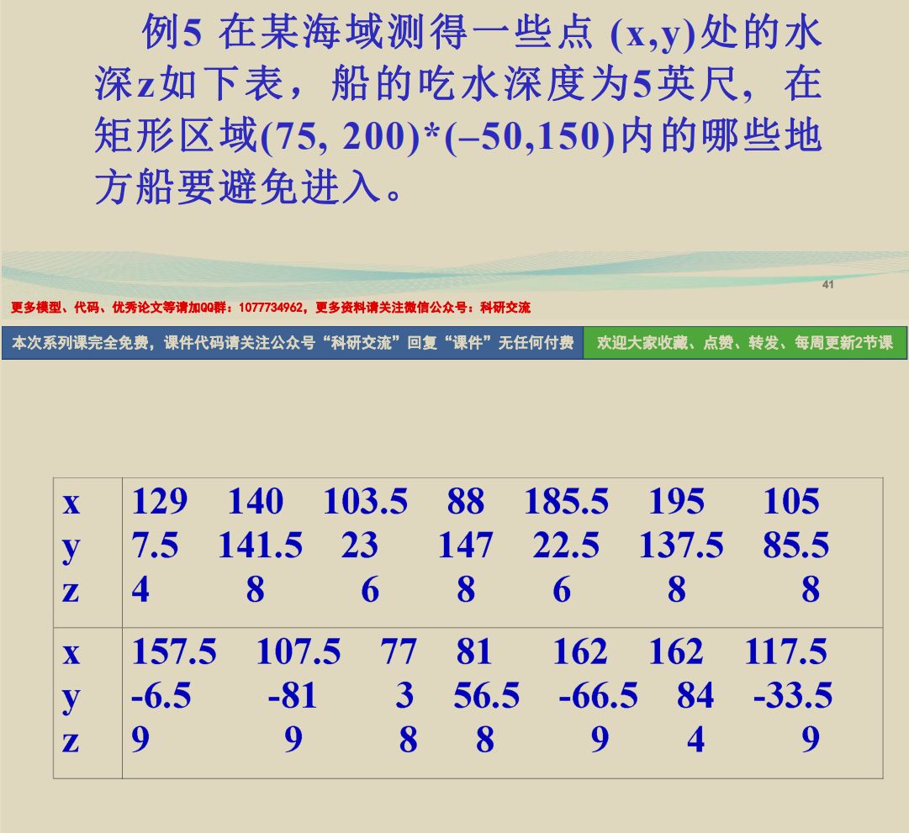

# 插值和拟合
---
插值和拟合都是数据分析的一种手段
## 插值

常见的插值方法有Lagrange插值法和Newtow插值法
**高次插值具有Runge现象**
插值多项式的次数超过七时,插值多项式会出现严重的振荡现象,称之为Runge现象。

因此,在实际中不应使用七次以上的插值。避免Runge现象的常用方法是将插值区间分成若干小区间，在小区间内用低次(二次,三次)插值,即分段低次插值，如样条函数插值。



### 使用MATLAB进行插值

**一维插值**


一维插值命令是interp1，其基本格式为yi= interp1(x,y,xi, 'method')。x, y为插值点，xi,yi为被插值点和插值结果,x,y和xi,yi通常为向量; 'method'表示插值方法:'nearest'—最邻近插值,'linear'—线性插值， 'spline'—三次样条插值，'cubic'—立方插值,缺省为线性插值。
1. 例题1

代码
``` MATLAB
x=0:2:24;
y=[12 9 9 10 18 24 28 27 25 20 18 15 13];x1=13;
y1=interp1(x,y,x1,'spline')
xi=0:1/3600:24;
yi=interp1(x,y,xi, 'spline');
plot(x,y, '*',xi,yi)
```
2. 例题2

代码
```MATLAB
function planex0=[0 3 5 7 9 11 12 13 14 15 ];
y0=[0 1.2 1.7 2.0 2.1 2.0 1.8 1.2 1.0 1.6 ];
x=0:0.1:15y1=lagrange(x0,y0,x);
y2=interp1(x0,y0,x);
y3=interp1(x0,y0,x,'spline');
subplot(3,1,1);
plot(x0,y0,'k+',x,y1,'r');
grid;
title('lagrange');
subplot(3,1,2);
plot(x0,y0,'k+',x,y2,'r');
grid;
title('piecewise linear');
subplot(3,1,3);
plot(x0,y0,'k+',x,y3,'r');
grid;
title('spline');
function y=lagrange(x0,y0,x)
n=length(x0);
m=length(x);
for i=1:m
z=x(i);
s=0.0;
     for k=1:n
     p=1.0;
         for j=1:n
             if j~=k
             p=p*(z-x0(j))/(x0(k)-x0(j));
             end
         end
         s=p*y0(k)+s;
    end
    y(i)=s;
end
```
程序依次用Lagrange、分段线性和三次样条三种插值方法进行了计算，其中Lagrange高次插值明显出现了Runge现象；

**二维插值**


二维插值二维插值命令是interp2, 基本格式为zi=interp2(x,y,z,xi,yi,'method')。二维插值命令的使用较复杂。x,y,z为插值点，z可以理解为被插值函数在(x,y)处的值；xi,yi为被插值点, zi为输出的插值结果，可理解为插值函数在(xi,yi)处的值；x,y为向量，xi,yi为向量或矩阵，而z和zi则为矩阵。'method'表示插值方法：'nearest'—最邻近插值,'linear'—双线性插值,'spline'—双三次样条插值，'cubic'—双立方插值，黙认双线性插
3. 例题3

```matlab
x=1:5;
y=1:3;
temps=[82 81 80 82 84;79 63 61 65 81;84 8482 85 86];
figure(1);
mesh(x,y,temps);
xi=1:0.2:5;
yi=1:0.2:3;
zi=interp2(x,y,temps,xi,yi','cubic');
figure(2);
mesh(xi,yi,zi);
figure(3);
contour(xi,yi,zi,20,'r');
[i,j]=find(zi==min(min(zi)));
x=xi(j),y=yi(i),zmin=zi(i,j);
[i,j]=find(zi==max(max(zi)));
x=xi(j),y=yi(i),zmax=zi(i,j)l
```
(1) interp2中的xi为行向量, 而yi'为向量, 其实xi和yi行列不同即可。
(2) plot3(空间曲线), mesh(空间曲面)surf (空间曲面), contour(等高线)是三作图中的常用命令。mesh和surf的区别是：mesh画的是曲面网格图，而surf画的是曲面表面图。contour (x,y,z,n)的功能是作出由点(x,y,z)插值而成曲面的n条等高线。用meshc和surfc可在曲面下方画等高线。meshz和surfz是画垂帘图。
4. 例题4

代码
```matlab
x=0:400:5600;
y=0:400:4800;
z=[370 470 550 600 670 690 670 620 580 450 400 300 100 150 250;... 
510 620 730 800 850 870 850 780 720 650 500 200 300 350 320;...
650 760 880 970 1020 1050 1020 830 900 700 300 500 550 480 350;... 
740 880 1080 1130 1250 1280 1230 1040 900 500 700 780 750 650 550;... 
830 980 1180 1320 1450 1420 1400 1300 700 900 850 840 380 780 750;... 
880 1060 1230 1390 1500 1500 1400 900 1100 1060 950 870 900 930 950;... 
910 1090 1270 1500 1200 1100 1350 1450 1200 1150 1010 880 1000 1050 1100;... 
950 1190 1370 1500 1200 1100 1550 1600 1550 1380 1070 900 1050 1150 1200;... 
1430 1430 1460 1500 1550 1600 1550 1600 1600 1600 1550 1500 1500 1550 1550;...
1420 1430 1450 1480 1500 1550 1510 1430 1300 1200 980 850 750 550 500;...
1380 1410 1430 1450 1470 1320 1280 1200 1080 940 780 620 460 370 350;...
1370 1390 1410 1430 1440 1140 1110 1050 950 820 690 540 380 300 210;...
1350 1370 1390 1400 1410 960 940 880 800 690 570 430 290 210 150];
figure(1);
meshz(x,y,z);
xlabel('X'),ylabel('Y'),zlabel('Z');
[xi,yi]=meshgrid(0:50:5600,0:50:4800);
figure(2);
z1i=interp2(x,y,z,xi,yi,'nearest');
surfc(xi,yi,z1i);
xlabel('X'),ylabel('Y'),zlabel('Z');
figure(3);
z2i=interp2(x,y,z,xi,yi);
surfc(xi,yi,z2i);
xlabel('X'),ylabel('Y'),zlabel('Z');
figure(4);
z3i=interp2(x,y,z,xi,yi,'cubic');
surfc(xi,yi,z3i);
xlabel('X'),ylabel('Y'),zlabel('Z');
figure(5);
subplot(1,3,1),contour(xi,yi,z1i,10,'r');
subplot(1,3,2),contour(xi,yi,z2i,10,'r');
subplot(1,3,3),contour(xi,yi,z3i,10,'r');
```
程序用“[xi,yi]=meshgrid(0:50:5600,0:50:4800);”生成网格点(xi,yi)，作用相当于“xi=0:50:5600;yi'=0:50:4800;”,但meshgrid(x,y)生成的xi,yi为同维矩阵，xi的行均为x，而yi的列均为y


**散乱点插值**
前面讨论的插值问题的插值点(x, y)均为网格点。当( x , y )为散乱点时，可用griddata(x,y,z,xi,yi,'method') 命令进行二维插值。

代码
```matlab
clearx=[129 140 103.5 88 185.5 195 105.5 157.5107.5 77 81 162 162 117.5];
y=[7.5 141.5 23 147 22.5 137.5 85.5 -6.5 -81 356.5 -66.5 84 -33.5];
z=[-4 -8 -6 -8 -6 -8 -8 -9 -9 -8 -8 -9 -4 -9];
[xi,yi]=meshgrid(75:0.5:200,-70:0.5:150);
zi=griddata(x,y,z,xi,yi,'cubic');
figure(1);
meshz(xi,yi,zi);
xlabel('X'),ylabel('Y'),zlabel('Z');
figure(2),contour(xi,yi,zi,[-5 -5],'b');
grid;
hold on;
plot(x,y,'+');xlabel('X'),ylabel('Y');
```